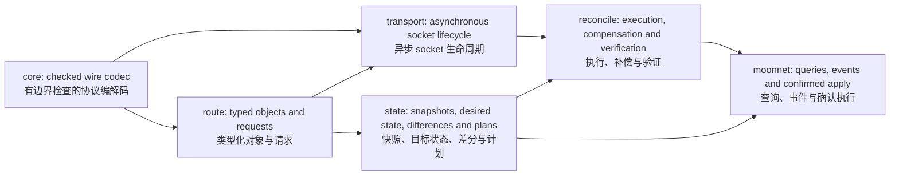

# Implementation and design / 实现与设计

MoonNetlink implements the RTNetlink protocol, typed models, asynchronous
request lifecycle and desired-state reconciliation in MoonBit. The native shim
opens a Linux socket, sets its options and transfers descriptor ownership. It
does not encode messages, decode models or execute networking commands.

MoonNetlink 在 MoonBit 中实现 RTNetlink 协议、类型化模型、异步请求生命周期和目标状态收敛。原生 shim 负责打开 Linux socket、设置选项并移交描述符所有权，不编码消息、不解码模型，也不执行网络配置命令。

Arrows show layers providing data and operations to their consumers. The pure
`core`, `route` and `state` layers do not depend on the transport. The CLI uses
the same public SDK and reconciliation APIs available to downstream callers.

箭头表示各层向使用方提供数据和操作。纯逻辑的 `core`、`route`、`state` 不依赖传输层。CLI 使用与下游调用者相同的公共 SDK 和收敛 API。

| Layer 层 | Implemented responsibility 已实现职责 | Evidence 验证证据 |
| --- | --- | --- |
| [core](core.md) | Checked lengths/alignment, multipart messages, unknown attributes, control messages and extended ACK diagnostics 校验长度和对齐、多部分消息、未知属性、控制消息与扩展 ACK 诊断 | Truncation, bad length, flag and control fixtures in `core/` `core/` 中的截断、错误长度、标志和控制样例 |
| [route](route.md) | Typed Link/Address/Route/Neighbor models, strict IP/MAC values and validated mutation requests 类型化 Link/Address/Route/Neighbor、严格 IP/MAC 值、已校验修改请求 | Model fixtures and request roundtrips in `route/` `route/` 中的模型样例和请求往返测试 |
| [transport](transport.md) | Independent descriptor ownership, serialized requests, sequence correlation, bounded waiting, ACK/dump errors and lossy multicast events 独立描述符所有权、串行请求、序列号关联、有界等待、ACK/导出错误及可能丢失的组播事件 | Fault fixtures plus live namespace tests in `transport/` `transport/` 中的故障样例与真实命名空间测试 |
| [state](state.md) | Owned snapshots, bounded strict desired schema, explicitly managed resources, deterministic differences/plans and whole-plan protection 拥有数据的快照、有界严格目标 schema、显式管理资源、确定性差分和计划、整计划保护 | Scope, collision, ordering and protection tests in `state/` `state/` 中的管理范围、冲突、排序和保护测试 |
| [reconcile](reconcile.md) | Ordered execution, partial reports, reverse best-effort compensation and fresh desired-state verification 顺序执行、部分报告、倒序尽力补偿、重新观测目标状态验证 | Injectable backend failure/cancellation tests and real CLI failure integration 可注入 backend 的失败与取消测试、真实 CLI 失败集成 |
| [CLI](cli.md) | Deterministic query JSON, typed JSONL events, read-only preview and explicitly confirmed execution 确定性查询 JSON、类型化 JSONL 事件、只读预演与显式确认执行 | Isolated network scripts in `.ci/` and the [demonstrations](demo.md) `.ci/` 中的隔离网络脚本与[演示](demo.md) |

The protocol layer can reject malformed input without opening a socket. Typed
requests reject invalid IP families, prefixes and indices before sending bytes.
The transport distinguishes kernel rejection from timeout or event loss and
does not accept an ambiguously truncated datagram as a complete dump. These
behaviors remain useful to SDK consumers who never run the CLI.

协议层无需打开 socket 即可拒绝畸形输入；类型化请求在发送字节前拒绝非法 IP 协议族、前缀和索引。传输层区分内核拒绝、超时、丢事件，不将可能截断的数据报当作完整导出。这些行为对不使用 CLI 的 SDK 调用者同样有用。

The state layer adds a separate configuration workflow. It changes only
explicitly declared resources, refuses conflicting identities and builds an
ordered plan. Whole-plan checks recompute loopback/default-route protection
before writing. The executor records acknowledged, failed and unexecuted steps;
after compensation or completion it queries again and determines whether the
declared goals were actually met. An ACK alone cannot make the final report
successful. A fake backend lets these semantics be tested without privileges.

状态层提供独立配置流程，只修改显式声明的资源，拒绝身份冲突，构建有序计划。整计划检查在写入前重新计算回环接口和默认路由保护。执行器记录已确认、失败、未执行步骤；执行或补偿后再次查询，判断声明目标是否真实达成。单独 ACK 不能使最终报告成功；模拟 backend 可在无权限环境测试这些语义。

The SDK never invokes `ip` for networking operations. Demo and acceptance
scripts use `ip` to create disposable fixtures and independently compare the
kernel's state. This separates implementation from its validation oracle.

SDK 执行网络操作不调用 `ip`；演示和验收脚本使用 `ip` 创建临时测试环境，并独立比较内核状态，使实现与用于核对结果的工具分离。

The supported scope remains explicit: native Linux, selected Link/IP/unicast
route mutations and observable multicast events. Snapshots are successive
queries, not an atomic kernel snapshot. External writers and implicit kernel
effects can defeat compensation; unknown outcomes and compensation failures
are reported. No performance advantage, broad kernel compatibility or published
package availability is implied by these design choices.

支持范围明确限定为 native Linux、选定的 Link/IP/单播路由修改及可观测组播事件。快照由多次连续查询组成，不是原子内核快照。外部写入者、隐式内核效果可能导致补偿无法恢复；结果未确定和补偿失败会报告。这些设计不代表已证明性能优势、广泛内核兼容，也不意味着已有公开发布包。
