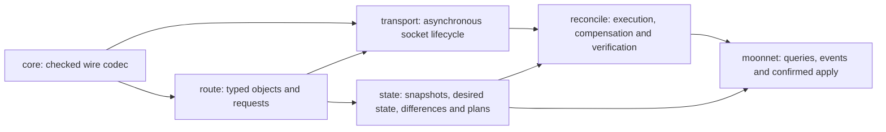

# Implementation and design

MoonNetlink implements the RTNetlink protocol, typed models, asynchronous
request lifecycle and desired-state reconciliation in MoonBit. The native shim
opens a Linux socket, sets its options and transfers descriptor ownership. It
does not encode messages, decode models or execute networking commands.

Arrows show layers providing data and operations to their consumers. The pure
`core`, `route` and `state` layers do not depend on the transport. The CLI uses
the same public SDK and reconciliation APIs available to downstream callers.

| Layer | Implemented responsibility | Evidence |
| --- | --- | --- |
| [core](core.md) | Checked lengths/alignment, multipart messages, unknown attributes, control messages and extended ACK diagnostics | Truncation, bad length, flag and control fixtures in `core/` |
| [route](route.md) | Typed Link/Address/Route/Neighbor models, strict IP/MAC values and validated mutation requests | Model fixtures and request roundtrips in `route/` |
| [transport](transport.md) | Independent descriptor ownership, serialized requests, sequence correlation, bounded waiting, ACK/dump errors and lossy multicast events | Fault fixtures plus live namespace tests in `transport/` |
| [state](state.md) | Owned snapshots, bounded strict desired schema, explicitly managed resources, deterministic differences/plans and whole-plan protection | Scope, collision, ordering and protection tests in `state/` |
| [reconcile](reconcile.md) | Ordered execution, partial reports, reverse best-effort compensation and fresh desired-state verification | Injectable backend failure/cancellation tests and real CLI failure integration |
| [CLI](cli.md) | Deterministic query JSON, typed JSONL events, read-only preview and explicitly confirmed execution | Seven `.ci/validate-*.sh` scripts and the [demonstrations](demo.md) |

The protocol layer can reject malformed input without opening a socket. Typed
requests reject invalid IP families, prefixes and indices before sending bytes.
The transport distinguishes kernel rejection from timeout or event loss and
does not accept an ambiguously truncated datagram as a complete dump. These
behaviors remain useful to SDK consumers who never run the CLI.

The state layer adds a separate configuration workflow. It changes only
explicitly declared resources, refuses conflicting identities and builds an
ordered plan. Whole-plan checks recompute loopback/default-route protection
before writing. The executor records acknowledged, failed and unexecuted steps;
after compensation or completion it queries again and determines whether the
declared goals were actually met. An ACK alone cannot make the final report
successful. A fake backend lets these semantics be tested without privileges.

The SDK never invokes `ip` for networking operations. Demo and acceptance
scripts use `ip` to create disposable fixtures and independently compare the
kernel's state. This separates implementation from its validation oracle.

The supported scope remains explicit: native Linux, selected Link/IP/unicast
route mutations and observable multicast events. Snapshots are successive
queries, not an atomic kernel snapshot. External writers and implicit kernel
effects can defeat compensation; unknown outcomes and compensation failures
are reported. No performance advantage, broad kernel compatibility or published
package availability is implied by these design choices.
